# Files Manager - Sequence Diagrams

## 1. File Upload Flow (Optimized with S3 Presigned URL)


## 2. File Download Flow (Optimized with CloudFront CDN)

```mermaid
sequenceDiagram
    actor User
    participant Frontend
    participant API Gateway
    participant Auth Service
    participant Download Service
    participant Redis Cache
    participant CloudFront
    participant Lambda@Edge
    participant S3
    participant Database
    participant Analytics Queue

    User->>Frontend: Click download file
    Frontend->>API Gateway: GET /files/:fileId/download
    API Gateway->>Auth Service: Verify JWT token (cached in Redis)
    Auth Service-->>API Gateway: Token valid
    
    API Gateway->>Download Service: Request file download
    
    %% Check cache first
    Download Service->>Redis Cache: Get file metadata + permissions
    
    alt Cache hit
        Redis Cache-->>Download Service: Cached file details
    else Cache miss
        Download Service->>Database: Get file metadata & permissions
        Database-->>Download Service: File details
        Download Service->>Redis Cache: Cache for 1hr
    end
    
    Download Service->>Download Service: Check user permissions
    
    alt User has permission
        alt Public file (images, videos)
            Download Service-->>Frontend: CloudFront URL (unsigned)
            Frontend->>CloudFront: Request file
            
            alt Cache hit at edge
                CloudFront-->>User: File from edge cache (50ms)
                Note over CloudFront,User: ⚡ Served from nearest edge location
            else Cache miss
                CloudFront->>Lambda@Edge: Process request
                Lambda@Edge->>S3: Fetch original
                S3-->>Lambda@Edge: File data
                Lambda@Edge->>Lambda@Edge: Optimize (compress, resize)
                Lambda@Edge-->>CloudFront: Optimized file
                CloudFront->>CloudFront: Cache at edge (24hrs)
                CloudFront-->>User: File data stream
            end
        else Private file
            Download Service->>Download Service: Generate CloudFront signed URL (1hr TTL)
            Download Service-->>Frontend: Signed CloudFront URL
            Frontend->>CloudFront: Request with signature
            Lambda@Edge->>Lambda@Edge: Verify signature
            CloudFront->>S3: Fetch if not cached
            S3-->>CloudFront: File data
            CloudFront-->>User: File data stream
        end
        
        %% Async analytics
        Download Service->>Analytics Queue: Log download event (async)
        Analytics Queue->>Database: Update download count (batch)
        
    else No permission
        Download Service-->>API Gateway: 403 Forbidden
        API Gateway-->>Frontend: Access denied
        Frontend-->>User: Show error message
    end

    Note over CloudFront,User: 🌍 16x faster with edge caching
    Note over Lambda@Edge: 🎯 On-the-fly optimization (WebP, resize)
```

## 3. File Delete Flow (Optimized with Soft Delete + Async Cleanup)

```mermaid
sequenceDiagram
    actor User
    participant Frontend
    participant API Gateway
    participant Auth Service
    participant File Service
    participant Redis Cache
    participant Database
    participant Queue
    participant Lambda
    participant S3
    participant CloudFront

    User->>Frontend: Click delete file
    Frontend->>Frontend: Show confirmation dialog
    User->>Frontend: Confirm deletion
    
    Frontend->>API Gateway: DELETE /files/:fileId
    API Gateway->>Auth Service: Verify JWT token (cached)
    Auth Service-->>API Gateway: Token valid
    
    API Gateway->>File Service: Request file deletion
    
    %% Check cache for permissions
    File Service->>Redis Cache: Get file metadata
    
    alt Cache hit
        Redis Cache-->>File Service: Cached file details
    else Cache miss
        File Service->>Database: Get file metadata & check ownership
        Database-->>File Service: File details
    end
    
    File Service->>File Service: Verify user is owner/admin
    
    alt User authorized
        %% Immediate soft delete (fast response)
        File Service->>Database: Soft delete (set deleted_at, status='deleted')
        Database-->>File Service: Updated (indexed query)
        
        %% Invalidate caches immediately
        par Cache Invalidation
            File Service->>Redis Cache: Delete file cache
            File Service->>Redis Cache: Invalidate user's file list
        end
        
        File Service-->>Frontend: 200 OK (instant response)
        Frontend-->>User: Show success message
        
        %% Async cleanup (doesn't block user)
        File Service->>Queue: Publish delete event
        
        par Async Cleanup Operations
            Queue->>Lambda: Trigger cleanup job
            
            Lambda->>CloudFront: Invalidate CDN cache
            CloudFront-->>Lambda: Invalidation started
            
            Lambda->>S3: Delete file + thumbnails
            S3-->>Lambda: Deletion confirmed
            
            Lambda->>Database: Update related records
            Note over Lambda: - Remove from shares<br/>- Delete thumbnails metadata<br/>- Update storage quota
            
            Lambda->>Database: Hard delete after 30 days (lifecycle)
        end
        
    else Not authorized
        File Service-->>API Gateway: 403 Forbidden
        API Gateway-->>Frontend: Access denied
        Frontend-->>User: Show error message
    end

    Note over File Service,Frontend: ⚡ Instant response with soft delete
    Note over Queue,S3: 🗑️ Actual S3 deletion happens async (30s grace period)
```



## 4. List Files Flow (Optimized with Multi-Level Caching)

```mermaid
sequenceDiagram
    actor User
    participant Frontend
    participant API Gateway
    participant Auth Service
    participant File Service
    participant Redis Cache
    participant Database Read Replica
    participant CDN

    User->>Frontend: Navigate to files page
    
    %% Client-side cache check (instant load)
    Frontend->>Frontend: Check localStorage cache
    
    alt Fresh client cache (<5min)
        Frontend->>Frontend: Render from local cache
        Frontend-->>User: Display files (instant)
        Frontend->>API Gateway: GET /files/delta (background refresh)
    else Stale or no cache
        Frontend->>API Gateway: GET /files?page=1&limit=20&sort=date
    end
    
    API Gateway->>Auth Service: Verify JWT token (Redis cache)
    Auth Service-->>API Gateway: Token valid
    
    API Gateway->>File Service: Request files list
    
    %% Redis cache with smart key
    File Service->>File Service: Generate cache key (userId+page+filters+sort)
    File Service->>Redis Cache: Get cached list
    
    alt Cache hit (hot data)
        Redis Cache-->>File Service: Cached files list
        Note over Redis Cache: TTL: 5 min for active users
    else Cache miss
        %% Read from replica to avoid main DB load
        File Service->>Database Read Replica: Optimized query
        Note over Database Read Replica: - Indexed queries<br/>- Filtered projections<br/>- Pagination with cursor
        Database Read Replica-->>File Service: Files list
        
        par Parallel operations
            File Service->>Redis Cache: Cache result (5min TTL)
            File Service->>File Service: Generate thumbnail URLs (CloudFront)
        end
    end
    
    %% Enrich with CDN URLs
    File Service->>File Service: Add CloudFront URLs for thumbnails
    File Service->>File Service: Calculate totals (from cache)
    
    File Service-->>API Gateway: Files list + pagination metadata
    API Gateway-->>Frontend: Return optimized response
    
    par Frontend Optimization
        Frontend->>Frontend: Store in localStorage
        Frontend->>Frontend: Virtual scrolling (render visible only)
        Frontend->>CDN: Lazy load thumbnails
        CDN-->>Frontend: Thumbnails (cached at edge)
    end
    
    Frontend-->>User: Display files (optimized)

    Note over Redis Cache: 🚀 95% cache hit rate for active users
    Note over Frontend: 📱 Virtual scrolling + lazy load = smooth UX
```



## 5. File Share Flow (Optimized with Token-Based Access)


## 6. File Search Flow (Optimized with Elasticsearch + Smart Caching)

```mermaid
sequenceDiagram
    actor User
    participant Frontend
    participant API Gateway
    participant Auth Service
    participant Search Service
    participant Redis Cache
    participant Elasticsearch
    participant Database Read Replica

    User->>Frontend: Type search query
    
    %% Debounced search with autocomplete
    Frontend->>Frontend: Debounce input (300ms)
    
    alt Autocomplete (prefix search)
        Frontend->>API Gateway: GET /files/autocomplete?q=prefix
        Search Service->>Redis Cache: Get popular searches
        Redis Cache-->>Frontend: Suggestions (cached)
    end
    
    User->>Frontend: Submit full search
    Frontend->>API Gateway: GET /files/search?q=query&filters={}&page=1
    
    API Gateway->>Auth Service: Verify JWT token (cached)
    Auth Service-->>API Gateway: Token valid
    
    API Gateway->>Search Service: Process search request
    
    %% Generate cache key with filters
    Search Service->>Search Service: Generate cache key (query+userId+filters)
    Search Service->>Redis Cache: Check cached results
    
    alt Cache hit (recent search)
        Redis Cache-->>Search Service: Cached results
        Note over Redis Cache: TTL: 5 min for search results
    else Cache miss
        %% Elasticsearch for fast full-text search
        Search Service->>Elasticsearch: Search query
        Note over Elasticsearch: - Fuzzy matching<br/>- Relevance scoring<br/>- Faceted search<br/>- Highlighting
        
        Elasticsearch-->>Search Service: Matching file IDs + scores
        
        %% Permission filtering at query time
        Search Service->>Search Service: Apply permission filters (userId)
        
        par Parallel Data Enrichment
            Search Service->>Redis Cache: Get file metadata (batch)
            alt Metadata cached
                Redis Cache-->>Search Service: Cached metadata
            else Metadata not cached
                Search Service->>Database Read Replica: Fetch metadata (batch)
                Database Read Replica-->>Search Service: File details
                Search Service->>Redis Cache: Cache metadata
            end
        end
        
        %% Add CloudFront URLs
        Search Service->>Search Service: Enrich with thumbnail URLs
        
        %% Cache results for next time
        Search Service->>Redis Cache: Cache search results (5min)
        
        %% Track search analytics async
        Search Service->>Queue: Log search query (analytics)
    end
    
    Search Service-->>API Gateway: Search results + facets
    API Gateway-->>Frontend: Files matching query
    
    %% Frontend optimization
    par Frontend Rendering
        Frontend->>Frontend: Highlight matching terms
        Frontend->>Frontend: Group by relevance/date
        Frontend->>Frontend: Lazy load thumbnails
        Frontend->>CDN: Load thumbnails on scroll
    end
    
    Frontend-->>User: Display search results with filters
    
    %% User refines search
    User->>Frontend: Apply filters (type, date, size)
    Frontend->>Frontend: Update URL params
    Frontend->>API Gateway: GET /files/search?q=query&type=image&date=recent
    Note over Search Service: Process refined search (cache miss likely)

    Note over Elasticsearch: 🔍 Sub-100ms search response
    Note over Redis Cache: ⚡ 80% cache hit rate for popular searches
    Note over Frontend: 💡 Debounced + autocomplete = better UX
```



## Key Components

### Services
- **API Gateway**: Entry point for all requests, handles routing and rate limiting
- **Auth Service**: JWT validation and user authentication
- **Upload Service**: Handles file uploads and chunking for large files
- **Download Service**: Manages file downloads and generates signed URLs
- **File Service**: Core file management operations (CRUD)
- **Share Service**: Manages file sharing and permissions
- **Search Service**: Handles file search and filtering
- **Storage Service**: Interface to cloud storage (S3, Azure Blob, etc.)
- **Notification Service**: Sends emails and push notifications

### Data Stores
- **Database**: Stores file metadata, permissions, and user data
- **Cache**: Redis/similar for frequently accessed data
- **Queue**: Message queue for async operations (RabbitMQ, SQS, etc.)
- **Search Index**: Elasticsearch or similar for advanced search

### Security Considerations
- JWT token validation on every request
- Permission checks before file operations
- Signed URLs with expiration for downloads
- Rate limiting to prevent abuse
- Virus scanning on uploads (can be added to upload flow)
- Encryption at rest and in transit
